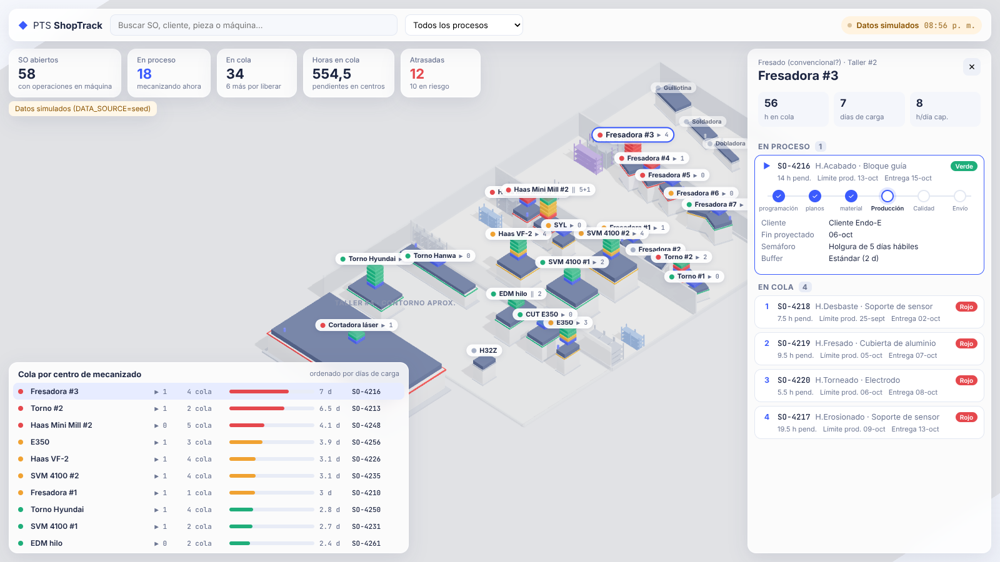

# PTS ShopTrack

Planta 3D de PTS con las **órdenes abiertas y en cola por centro de mecanizado**, leídas de Zoho Projects.



## Correr
```bash
npm install
cp .env.example .env      # DATA_SOURCE=seed para datos simulados
npm run dev               # http://localhost:5173
```
Para datos reales hay dos caminos:
- **Exportación de Zoho (Excel)**: exportar las tareas abiertas de todos los proyectos a `.xlsx`, guardarlo en
  `data/exportaciones/` y poner `DATA_SOURCE=excel`. Se usa el archivo más reciente; no se sube al repositorio.
  Qué columnas se leen y qué se deduce: `docs/ZOHO.md#exportación-a-excel`.
- **Zoho en vivo**: crear un *Self Client* en https://api-console.zoho.com, generar el refresh token con los scopes
  de `.env.example` y poner `DATA_SOURCE=zoho`.

En los dos casos revisar `config/centros.json` (qué máquinas hacen cada proceso).

## Asistente
Menú lateral → **Asistente**: un chat para consultar la carga y cambiar el plan con palabras (estados, llegada de
material, prioridad y fecha de un SO, máquina de una operación, máquinas fuera de servicio). Los cambios quedan en
ShopTrack, no en Zoho, y se pueden quitar. Necesita `ANTHROPIC_API_KEY` en `.env`. Detalle: `docs/ASISTENTE.md`.

## Estructura
| Carpeta | Qué hay |
|---|---|
| `web/` | Escena R3F (`escena/`), HUD (`hud/`) y módulos del menú lateral (`modulos/`) |
| `server/` | API Express, fuentes de datos (`fuentes/zoho.ts`, `fuentes/exportacion.ts`, `fuentes/seed.ts`) y asistente (`asistente.ts`) |
| `shared/` | Tipos y reglas de negocio: días hábiles y semáforo (`reglas.ts`), rutas (`ruta.ts`), plan sugerido (`plan.ts`), ajustes del supervisor (`ajustes.ts`) y herramientas del asistente (`asistente.ts`) |
| `scripts/` | `pagina.ts`: la app como página estática para publicarla en claude.ai |
| `data/layout/` | Layout real de la planta exportado del CAD |
| `data/exportaciones/` | Exportaciones de Zoho a Excel (no se suben) |
| `config/` | Máquinas, procesos y sus máquinas (`centros.json`), lectura de Zoho, feriados |
| `docs/` | Especificación, integración Zoho, plan de trabajo y referencias |
