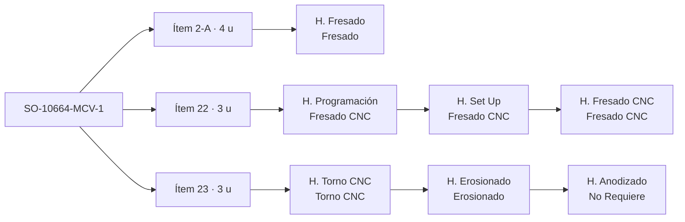

# Proceso de una orden en PTS

> **Borrador para validar con Alvaro.** Actualizado el 6-oct-2026 con una captura real de **SO-10664-MCV-1**
> y las decisiones de Alvaro. ✅ = visto en Zoho o decidido · ❓ = por confirmar · 💡 = propuesta.
> Detalle de campos en `docs/ZOHO.md`.

## Decisiones tomadas ✅ (6-oct-2026)

| Tema | Decisión |
|---|---|
| Estados de las tareas | Solo **Pendiente, En proceso y Cerrada**. El estado del ítem y la fase del SO los calcula ShopTrack. |
| Material | Una tarea **Material** al inicio de cada ítem; se cierra cuando llega. Mientras esté abierta, el ítem está bloqueado. |
| Programación | La hace un **programador aparte**, en oficina: es una cola de personas, no ocupa máquina. |
| Máquina | ShopTrack **sugiere** la máquina según la carga; **el supervisor decide**. No se escribe nada en Zoho. |
| Horas estimadas | Son el **total de la tarea**, aunque tenga varios propietarios. |
| Orden de la ruta | El de la lista de tareas; a veces se altera por prioridades. |

## 1. Estructura de una orden ✅

| Nivel | En Zoho | Qué es |
|---|---|---|
| **SO** | Proyecto `SO-10664-MCV-1` | Una orden de un cliente. Su fecha final manda la prioridad. |
| **Ítem** | Lista de tareas `Ítem 23 (3 unidades)` | Una línea de la orden con su cantidad. Un SO puede tener muchos ítems independientes (este tiene al menos 2-A, 20, 21, 22 y 23), no solo ensambles. |
| **Operación** | Tarea `H. <proceso>` | Cada proceso por el que pasa el ítem, en el orden de la lista (su ruta). |
| **Proceso** | Equipo asignado | Fresado, Fresado CNC, Torno CNC, Erosionado, No Requiere (servicio externo). |
| **Máquina** | No está en Zoho | Se decide en planta. ShopTrack debe ayudar a repartir el trabajo. |

Rutas vistas en ese SO:

| Ítem | Cantidad | Ruta |
|---|---|---|
| 2-A | 4 | Fresado (convencional) |
| 20, 21, 22 | 3 cada uno | Programación → Set Up → Fresado CNC |
| 23 | 3 | Torno CNC → Erosionado → Anodizado (servicio externo) |

Avance ✅: se cambia el estado de la tarea y se registran horas (Registros de tiempo). El orden de la ruta es el
de la lista; a veces se altera por prioridades.

## 2. Lo que enseña la captura

1. **Programación, Set Up y mecanizado son tareas separadas.**
   - Programación es tiempo del programador, no de la máquina, y es la condición para que el ítem pase a máquina.
   - Set Up y Fresado CNC ocupan la misma máquina, uno detrás del otro: para repartir se tratan como una sola
     visita a la máquina.
   - Hoy ShopTrack sumaría las horas de programación como carga de máquina.
2. **El servicio externo es un paso más de la ruta** (Anodizado, equipo "No Requiere"). Dura días de proveedor,
   no horas de máquina.
3. **Los estados mezclan avance y bloqueo.** `Material Pendiente` está puesto en todas las tareas del ítem, aunque
   es una condición del ítem. Por eso el estado de las tareas no dice qué está pasando de verdad.
4. **Los nombres tienen errores de escritura** (`H. Progrmación`): el proceso se toma del equipo asignado.
5. Un SO puede ser una orden grande con muchas líneas, no solo un ensamble.

## 3. Propuesta para ordenar Zoho 💡

| Hoy | Propuesta |
|---|---|
| Estados que mezclan avance y bloqueo (`Material Pendiente`, `Pendiente Op…`) | Tres estados por tarea: **Pendiente, En proceso, Cerrada** |
| `Material Pendiente` repetido en cada tarea | Una tarea **Material** al inicio de cada ítem (sin `H.`), que se cierra cuando llega el material ✅ |
| Planos ❓ | Igual: tarea **Planos** al inicio del ítem o del SO |
| Calidad, ensamble y envío en el estado del proyecto | Lista final **Cierre** en cada SO: Ensamble (si aplica), Calidad, Envío ❓ |
| Equipo "No Requiere" para servicios externos | Equipo **Servicio externo**, con el proveedor en el nombre de la tarea |
| Máquina sin registrar | La sugiere ShopTrack y el supervisor decide; no se escribe en Zoho ✅ |

Mientras se hace el cambio en Zoho, ShopTrack puede leer los dos esquemas: `Material Pendiente` cuenta como
ítem bloqueado por material y los demás estados se traducen a Pendiente, En proceso o Cerrada.

Con eso no hay que mantener estados a mano en otros niveles; ShopTrack los calcula:
- **Ítem**: Pendiente (nada empezado), En proceso, Cerrado (todas sus tareas cerradas).
- **Fase del SO** (programación, material, producción, calidad, envío): sale de sus ítems y de la lista Cierre.

## 4. Cómo lo usaría ShopTrack

**Centros de trabajo = equipos de Zoho**, cada uno con sus máquinas (propuesta ❓):

| Equipo | Máquinas |
|---|---|
| Fresado | Fresadora #1 a #7 |
| Fresado CNC | Haas VF-2, SVM 4100 #1 y #2, Haas Mini Mill #1 y #2, SYL |
| Torno CNC | Torno Hyundai, Torno Hanwa |
| Torno | Torno #1 y #2 |
| Erosionado | EDM hilo, CUT E350, E350 |
| Programación | Programadores: cola de personas, no ocupa máquina ✅ |
| Servicio externo / No Requiere | Proveedores, fuera de planta |

Cada **operación** tiene un estado calculado con su ítem:

| Estado | Significa | Regla |
|---|---|---|
| Hecha | Ya pasó por ese proceso | Tarea cerrada |
| En proceso | Se está trabajando | Tarea en proceso |
| En cola | La pieza está esperando frente al centro | Las anteriores del ítem están cerradas y el material está listo |
| En camino | La pieza todavía va en una operación anterior | Alguna anterior del ítem está abierta |
| Bloqueada | Falta material, planos o programa | Tarea Material, Planos o Programación abierta |
| Fuera | En un proveedor | Servicio externo en proceso |

Y con eso:
- **Reparto de trabajo**: por cada centro, la cola ordenada por prioridad (límite de producción) y una
  **máquina sugerida** según la carga de cada una. Set Up y mecanizado van juntos a la misma máquina. El
  supervisor decide.
- **Horas pendientes** = horas estimadas − horas registradas.
- **Cola de cada máquina**: solo lo que está en proceso o realmente esperando; lo "en camino" se ve aparte.
- **¿Dónde está mi SO?**: cada ítem como una cadena de pasos con el actual resaltado.
- **Proyección**: simulación hacia adelante que respeta la ruta de cada ítem y la capacidad de cada centro.
  Da fin proyectado por operación, ítem y SO; el semáforo compara contra la entrega menos el buffer.

## 5. Observaciones

- **El buffer es la suma de los SLA que van después de producción**: calidad 1 + envío 1 = 2; + servicio
  externo 3 = 5; + ensamble 1 = 6. Con esa lógica, un SO con ensamble pero **sin** servicio externo debería
  llevar 3 días, pero la regla actual le da 2. ❓
- Si el servicio externo va **en medio** de la ruta (por ejemplo temple y después hilo), no es un buffer al final
  sino un paso de unos 3 días dentro de la ruta. Con la ruta completa en Zoho ya no hace falta el buffer por tipo
  de SO: el tiempo de cada paso sale de la ruta.
- Máquinas sin identificar (hipótesis por nombre y tamaño): **SYL** ≈ SYIL, fresadora CNC compacta;
  **E350** ≈ GF FORM E 350, electroerosión por penetración (está junto a la CUT E 350 de hilo);
  **H32Z** sin hipótesis.

## 6. Preguntas abiertas

1. Lista completa de equipos y qué máquinas pertenecen a cada uno (la tabla de la sección 4 es una propuesta).
2. Calidad, ensamble y envío: ¿lista final **Cierre** en cada SO, o siguen en el estado del proyecto?
3. Planos: ¿diseño interno o planos del cliente? ¿Una tarea **Planos** por ítem, como Material?
4. ¿Un SO con ensamble y sin servicio externo lleva buffer de 2 o de 3 días?
5. Calidad: ¿solo inspección final o también dentro de la ruta?
6. ¿Qué máquinas son SYL, E350 y H32Z?
7. ¿Qué significa `Pendiente Op…`? (Solo importa mientras se usen los estados actuales.)
