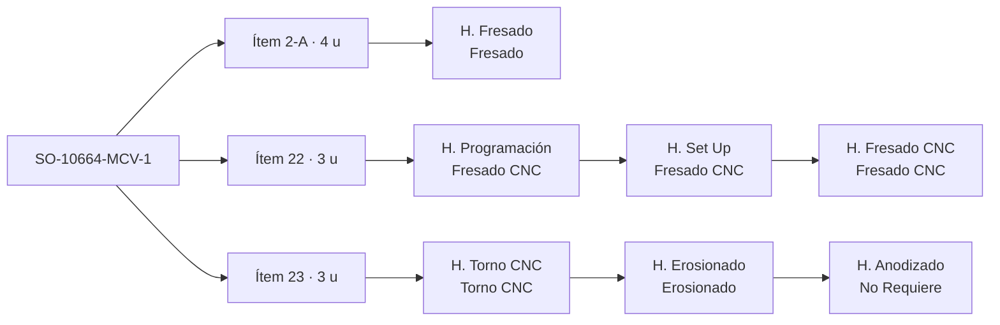

# Proceso de una orden en PTS

> **Borrador para validar con Alvaro.** Actualizado el 6-oct-2026 con una captura real de **SO-10664-MCV-1**,
> las decisiones de Alvaro y la primera exportación de tareas de Zoho (sección 6). ✅ = visto en Zoho o decidido · ❓ = por confirmar · 💡 = propuesta.
> Detalle de campos en `docs/ZOHO.md`.

## Decisiones tomadas ✅ (6-oct-2026)

| Tema | Decisión |
|---|---|
| Estados de las tareas | Solo **Pendiente, En proceso y Cerrada**. El estado del ítem y la fase del SO los calcula ShopTrack. |
| Material | Una tarea **Material** al inicio de cada ítem; se cierra cuando llega. Mientras esté abierta, el ítem está bloqueado. |
| Programación | La hace un **programador aparte**, en oficina: es una cola de personas, no ocupa máquina. |
| Máquina | ShopTrack **sugiere** la máquina según la carga; **el supervisor decide**. No se escribe nada en Zoho. |
| Horas estimadas | Son el **total de la tarea**, aunque tenga varios propietarios. |
| Orden de la ruta | El de la lista de tareas; a veces se altera por prioridades. |

## 1. Estructura de una orden ✅

| Nivel | En Zoho | Qué es |
|---|---|---|
| **SO** | Proyecto `SO-10664-MCV-1` | Una orden de un cliente. Su fecha final manda la prioridad. |
| **Ítem** | Lista de tareas `Ítem 23 (3 unidades)` | Una línea de la orden con su cantidad. Un SO puede tener muchos ítems independientes (este tiene al menos 2-A, 20, 21, 22 y 23), no solo ensambles. |
| **Operación** | Tarea `H. <proceso>` | Cada proceso por el que pasa el ítem, en el orden de la lista (su ruta). |
| **Proceso** | Equipo asignado | Fresado, Fresado CNC, Torno CNC, Erosionado, No Requiere (servicio externo). |
| **Máquina** | No está en Zoho | Se decide en planta. ShopTrack debe ayudar a repartir el trabajo. |

Rutas vistas en ese SO:

| Ítem | Cantidad | Ruta |
|---|---|---|
| 2-A | 4 | Fresado (convencional) |
| 20, 21, 22 | 3 cada uno | Programación → Set Up → Fresado CNC |
| 23 | 3 | Torno CNC → Erosionado → Anodizado (servicio externo) |

Avance ✅: se cambia el estado de la tarea y se registran horas (Registros de tiempo). El orden de la ruta es el
de la lista; a veces se altera por prioridades.

## 2. Lo que enseña la captura

1. **Programación, Set Up y mecanizado son tareas separadas.**
   - Programación es tiempo del programador, no de la máquina, y es la condición para que el ítem pase a máquina.
   - Set Up y Fresado CNC ocupan la misma máquina, uno detrás del otro: para repartir se tratan como una sola
     visita a la máquina.
   - Hoy ShopTrack sumaría las horas de programación como carga de máquina.
2. **El servicio externo es un paso más de la ruta** (Anodizado, equipo "No Requiere"). Dura días de proveedor,
   no horas de máquina.
3. **Los estados mezclan avance y bloqueo.** `Material Pendiente` está puesto en todas las tareas del ítem, aunque
   es una condición del ítem. Por eso el estado de las tareas no dice qué está pasando de verdad.
4. **Los nombres tienen errores de escritura** (`H. Progrmación`): el proceso se toma del equipo asignado.
5. Un SO puede ser una orden grande con muchas líneas, no solo un ensamble.

## 3. Propuesta para ordenar Zoho 💡

| Hoy | Propuesta |
|---|---|
| Estados que mezclan avance y bloqueo (`Material Pendiente`, `Pendiente Op…`) | Tres estados por tarea: **Pendiente, En proceso, Cerrada** |
| `Material Pendiente` repetido en cada tarea | Una tarea **Material** al inicio de cada ítem (sin `H.`), que se cierra cuando llega el material ✅ |
| Planos ❓ | Igual: tarea **Planos** al inicio del ítem o del SO |
| Calidad, ensamble y envío en el estado del proyecto | Lista final **Cierre** en cada SO: Ensamble (si aplica), Calidad, Envío ❓ |
| Equipo "No Requiere" para servicios externos | Equipo **Servicio externo**, con el proveedor en el nombre de la tarea |
| Máquina sin registrar | La sugiere ShopTrack y el supervisor decide; no se escribe en Zoho ✅ |

Mientras se hace el cambio en Zoho, ShopTrack puede leer los dos esquemas: `Material Pendiente` cuenta como
ítem bloqueado por material y los demás estados se traducen a Pendiente, En proceso o Cerrada.

Con eso no hay que mantener estados a mano en otros niveles; ShopTrack los calcula:
- **Ítem**: Pendiente (nada empezado), En proceso, Cerrado (todas sus tareas cerradas).
- **Fase del SO** (programación, material, producción, calidad, envío): sale de sus ítems y de la lista Cierre.

## 4. Cómo lo hace ShopTrack ✅ (implementado el 6-oct-2026)

Código: `shared/ruta.ts` (lectura y estados) y `shared/plan.ts` (plan), con tests en `tests/`.

**Centros de trabajo = procesos**, cada uno con sus recursos (`config/centros.json`, propuesta ❓). El proceso se lee
del Equipo asignado; si la tarea no lo trae (exportación a Excel), de su nombre:

| Proceso | Recursos |
|---|---|
| Fresado CNC | Haas VF-2, SVM 4100 #1 y #2, Haas Mini Mill #1 y #2, SYL |
| Fresado | Fresadora #1 a #7 |
| Torno CNC | Torno Hyundai ✅ (todo el torno CNC) |
| Torno suizo | Torno Hanwa ✅ (solo tareas específicas de torno; hoy, las "Torno Suizo") |
| Torno | Torno #1 y #2 |
| Erosionado | EDM hilo y CUT E350 ✅ (solo 2 erosionadoras) |
| Rectificado | Rectificadora #1 y #2, al fondo del Taller #1 ✅ (posición aproximada) |
| Tratamiento térmico y revenido | Horno |
| Doblado · Soldadura | Dobladora · Soldadora (la cortadora láser se quitó del plano, 6-oct ✅) |
| Grabado · Limpieza y rebabeo | Puestos manuales fuera del plano: 1 persona, 8 h/día cada uno ❓ |
| Programación | Programadores: cola de personas, no ocupa máquina ✅ (1 programador, 8 h/día ❓) |
| Servicio externo / No Requiere | Proveedores (Flash Chrome, anodizado, electroless, black oxide…): 3 días hábiles |

Cada **operación** tiene un estado calculado con su ítem:

| Estado | Significa | Regla |
|---|---|---|
| Hecha | Ya pasó por ese proceso | Tarea cerrada |
| En proceso | Se está trabajando | Tarea en proceso |
| En cola | La pieza está esperando frente al centro | Las anteriores del ítem están cerradas y el material está listo |
| En camino | La pieza todavía va en una operación anterior | Alguna anterior del ítem está abierta |
| Bloqueada | Falta material, planos o programa | Material o Planos abiertos, o Programación sin cerrar |
| En proceso (servicio externo) | En un proveedor | Tarea de servicio externo en proceso |

Dependencias: la **programación** solo espera los planos (se programa mientras llega el material); las
operaciones de **máquina** y el **servicio externo** esperan todo lo anterior de su ruta.

Cómo se arma el plan:
1. Lo que ya está **en proceso** ocupa su máquina (o programador) desde hoy. Zoho no dice en qué máquina está:
   el plan la estima.
2. Luego, SO por SO en orden de prioridad (fecha en que deben terminar sus rutas), cada ítem recorre su ruta:
   cada operación se pone en la máquina de su proceso que la **termina antes** (aprovechando huecos libres), sin
   empezar antes de que termine lo que la precede. Set Up y mecanizado van juntos a la misma máquina.
3. Duraciones: máquina y programación = horas pendientes ÷ capacidad diaria del recurso; servicio externo,
   material y planos = su SLA (3, 3 y 5 días hábiles); ensamble, calidad y envío = 1 día.
4. **Límites hacia atrás** desde la entrega: las rutas terminan `bufferDias − 3` días antes si llevan servicio
   externo (si no, `bufferDias`), o según la lista Cierre si existe; cada paso debe terminar a tiempo para que
   los que dependen de él quepan antes de su propio límite.
5. **Semáforo** de cada paso: fin proyectado contra su límite (rojo si no llega o el límite pasó; amarillo con
   holgura ≤ 1 día). El ítem y el SO toman el peor.

Horas pendientes = estimadas − registradas (si ya se pasó y sigue en proceso, media hora).

**Ajustes del supervisor** ✅ (pedido de Alvaro, 6-oct): desde el asistente (`docs/ASISTENTE.md`) el supervisor cambia
estados, marca la llegada de material, fija prioridad o fecha de entrega de un SO, fija la máquina de una operación
o saca una máquina del plan. Se guardan en ShopTrack (no en Zoho), se aplican antes de planificar y se pueden quitar.
Con prioridad fijada, esos SO van primero; después manda la fecha de entrega.

## 5. Observaciones

- **El buffer es la suma de los SLA que van después de producción**: calidad 1 + envío 1 = 2; + servicio
  externo 3 = 5; + ensamble 1 = 6. Con esa lógica, un SO con ensamble pero **sin** servicio externo debería
  llevar 3 días, pero la regla actual le da 2. ❓
- Si el servicio externo va **en medio** de la ruta (por ejemplo temple y después hilo), no es un buffer al final
  sino un paso de unos 3 días dentro de la ruta. Con la ruta completa en Zoho ya no hace falta el buffer por tipo
  de SO: el tiempo de cada paso sale de la ruta.
- Máquinas sin identificar (hipótesis por nombre y tamaño): **SYL** ≈ SYIL, fresadora CNC compacta;
  **E350** no es una erosionadora (Alvaro, 6-oct: solo hay dos, EDM hilo y CUT E350); queda en el plano sin proceso
  (¿equipo auxiliar de la CUT E 350?);
  **H32Z** sin hipótesis.

## 6. Lo que muestra la primera exportación (foto del 6-oct-2026)

538 tareas abiertas de 122 SO, unas 2 100 h. Sin fechas de entrega, el plan va por número de SO.

| Proceso | Horas abiertas | Listas para empezar | Días de carga lista |
|---|---|---|---|
| Fresado CNC (6 máquinas) | 610 h | 157 h | 1,8 |
| Erosionado (2 máquinas) | 551 h | 401 h | **12,5** |
| Torno CNC (solo el Hyundai) | 282 h | 230 h | **14,3** |
| Fresado (7) | 204 h | 113 h | 2 |
| Rectificado (2) | 163 h | 33 h | 2 |
| Tratamiento térmico y revenido (horno) | 112 h | 10 h | 0,4 |

- **Torno CNC es el cuello de botella**: 14 días de trabajo listo, todo en el Hyundai (el Hanwa queda para sus
  tareas específicas). **Erosionado** le sigue con 12,5 días en sus dos máquinas.
- Fresado CNC tiene la mayor carga total, pero casi toda espera programa, material u otra operación.
- Rectificado llega sobre todo después del tratamiento térmico: su carga lista crecerá cuando salgan del horno.
- Tratamiento térmico (5 h) y revenido (2 h) tienen horas fijas por tarea: parecen ciclos de horno que se pueden
  juntar en lotes. Hoy el plan los trata uno por uno a 24 h/día ❓.
- Grabado: 75 tareas de media hora, casi siempre al final de la ruta.
- 16 ítems esperan material (estado `Material Pendiente`).

## 7. Preguntas abiertas

1. Lista completa de equipos y qué máquinas pertenecen a cada uno (la tabla de la sección 4 es una propuesta),
   y cuántos programadores hay (hoy se supone 1, 8 h/día).
2. Calidad, ensamble y envío: ¿lista final **Cierre** en cada SO, o siguen en el estado del proyecto?
3. Planos: ¿diseño interno o planos del cliente? ¿Una tarea **Planos** por ítem, como Material?
4. ¿Un SO con ensamble y sin servicio externo lleva buffer de 2 o de 3 días?
5. Calidad: ¿solo inspección final o también dentro de la ruta?
6. ¿Qué máquinas son SYL y H32Z? ¿Y la E350, si no es erosionadora?
7. ~~¿Qué significa `Pendiente Op…`?~~ En la exportación es `Pendiente Operación`: se trata como Pendiente.
8. Rectificadoras: ¿cuál es la *centerless*? ¿Posición exacta y horas por día?
9. Grabado y limpieza: ¿dónde se hacen y cuántas personas o equipos hay? (hoy, un puesto de 8 h/día cada uno)
10. Horno: ¿tratamiento térmico y revenido se hacen en planta? ¿Cuántas piezas entran por ciclo?
11. ¿Qué tareas de torno van al Hanwa y cómo se llaman en Zoho? Hoy solo las "Torno Suizo"; el resto del torno CNC va
    al Hyundai. ¿Las erosionadoras trabajan más de 16 h al día (sin operador de noche)?
12. ¿Se puede exportar con **Lista de tareas**, **Equipo asignado** y la fecha final del proyecto? Con eso los
    ítems son exactos y vuelve el semáforo.
