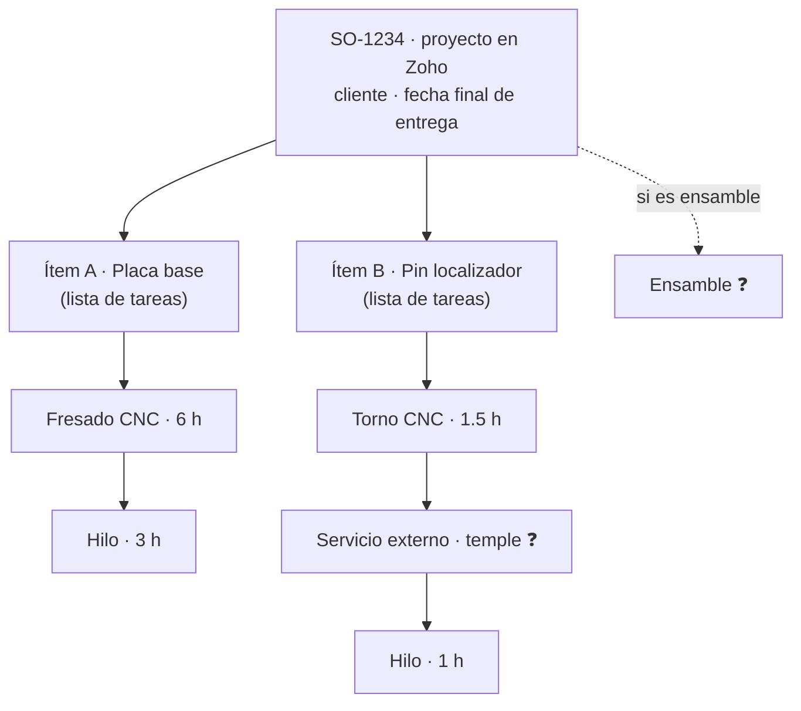
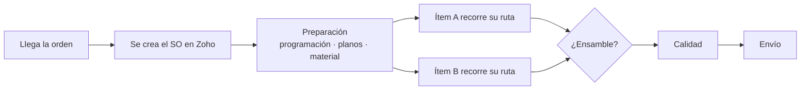

# Proceso de una orden en PTS

> **Borrador para validar con Alvaro** (6-oct-2026). Describe cómo entiendo el flujo real de una orden y qué
> tiene que cambiar en ShopTrack para respetarlo. Lo marcado con ❓ es suposición; las preguntas abiertas
> están al final.

## 1. Estructura de una orden

| Nivel | En Zoho | Qué es |
|---|---|---|
| **SO** | Proyecto `SO-…` | Una orden de un cliente. Su fecha final manda la prioridad. |
| **Ítem** | Lista de tareas | Cada pieza distinta. Un SO de una sola pieza tiene un ítem; un ensamble tiene varios. |
| **Operación** | Tarea dentro de la lista | Cada proceso por el que pasa la pieza (fresado convencional, fresado CNC, torno, hilo…), en orden. Lleva las horas estimadas. |

Es la misma estructura que usan los sistemas de taller (MES/ERP): orden → ítem → **ruta** de operaciones →
**centro de trabajo** donde se hace cada operación.

## 2. Cómo avanza una orden

- Un SO **no está en una sola fase**: cada ítem avanza por su cuenta. El ítem A puede estar en hilo mientras el
  B espera material. El estado del proyecto en Zoho (un valor por SO) resume, pero no dice dónde está cada pieza.
- Entre una operación y la siguiente, la pieza **espera en la cola** del siguiente centro. En un taller de alta
  variedad esa espera suele ser la mayor parte del tiempo de entrega, más que las horas de máquina.
- El ensamble solo puede empezar cuando **todos** los ítems que lo forman terminaron su ruta.

## 3. Por qué el modelo actual de ShopTrack no alcanza

- Trata cada tarea `H.*` como una operación suelta en una máquina, **sin ítem ni orden**. Cuando un SO pasa a
  Producción, todas sus operaciones aparecen "en cola" a la vez en todas sus máquinas, aunque la pieza apenas
  esté en la primera. Eso infla las colas (sobre todo de los procesos del final de la ruta, como hilo) y el semáforo.
- La proyección se calcula **por máquina, por separado**: puede dar que el hilo termine antes que el fresado que
  va antes en la ruta.
- La fase sale del estado del proyecto, así que todas las piezas de un SO muestran la misma fase.
- Servicio externo y ensamble se detectan buscando texto en los nombres y solo cambian el buffer (2/5/6 días);
  no aparecen como pasos con su propio tiempo.

## 4. Modelo propuesto para la app

Cada **operación** tiene un estado que depende de su ítem:

| Estado | Significa | Regla (por confirmar) |
|---|---|---|
| Hecha | Ya pasó por ese proceso | Tarea cerrada |
| En proceso | Se está trabajando | Tarea en progreso |
| En cola | La pieza está esperando frente al centro | La operación anterior está hecha y la preparación está lista |
| En camino | La pieza todavía va en una operación anterior | Alguna operación anterior del ítem está abierta |
| Bloqueada | Falta programa, plano o material | Preparación pendiente ❓ |
| Fuera | En un proveedor | Servicio externo en progreso |

Con eso:

- **Cola de cada centro**: solo lo que está en proceso o realmente esperando. Lo "en camino" se ve aparte
  (translúcido), con cuándo llegaría.
- **¿Dónde está mi SO?**: cada ítem como una cadena de pasos con el paso actual resaltado.
- **Proyección**: simulación hacia adelante que respeta el orden de cada ruta y la capacidad de cada centro. Una
  operación no empieza antes de que termine la anterior del mismo ítem ni antes de que el centro se libere. Da
  fin proyectado por operación, por ítem y por SO; el semáforo compara contra la entrega menos el buffer.

## 5. Cómo se leería de Zoho (por verificar con un SO real)

| Concepto | Dónde podría estar ❓ | Por confirmar |
|---|---|---|
| SO | Proyecto `SO-…` | Estado = fase; `end_date` = entrega; campo de cliente |
| Ítem | Lista de tareas | Formato del nombre (número de parte, descripción, cantidad) |
| Operación | Tarea de la lista | Nombre (¿`H. Fresado CNC`?), estado, horas (`owners_and_work`), horas registradas |
| Orden de la ruta | Posición en la lista, o dependencias (FS/SS/SF/FF) | Cuál se usa |
| Máquina | Campo personalizado, responsable/recurso, nombre de la tarea, o solo el proceso | Cuál se usa |
| Preparación | Estado del SO, tareas dentro de cada ítem, o Fases de Zoho | Cuál se usa |

Notas:

- En Zoho los antiguos "hitos" ahora se llaman **Fases**, y una lista de tareas puede asociarse a una fase. No
  son lo mismo que el estado del proyecto, que es lo que hoy la app usa como fase.
- Endpoints v3 a probar (VERIFICAR): `GET /api/v3/portal/{portal}/projects/{id}/tasklists` y
  `GET /api/v3/portal/{portal}/projects/{id}/tasks`. Hay fallas reportadas en la API v3 de horas registradas
  (timelogs); la v2 funciona.
- El entorno de nube donde se desarrolla no tiene acceso a `*.zoho.com`. Para leer datos reales hay que
  habilitar esos dominios en el entorno o correr la lectura en una PC de PTS.

## 6. Observaciones

- **El buffer es la suma de los SLA que van después de producción**: calidad 1 + envío 1 = 2; + servicio
  externo 3 = 5; + ensamble 1 = 6. Con esa lógica, un SO con ensamble pero **sin** servicio externo debería
  llevar 3 días, pero la regla actual le da 2. ❓
- Si el servicio externo va **en medio** de la ruta (por ejemplo temple y después hilo o rectificado), no es un
  buffer al final: es un paso de unos 3 días dentro de la ruta del ítem.
- Máquinas sin identificar (hipótesis por nombre y tamaño):
  - **SYL** ≈ SYIL, fresadora CNC compacta.
  - **E350** ≈ GF FORM E 350, electroerosión por penetración. Cuadra con que esté junto a la CUT E 350 (hilo)
    y con los electrodos que aparecen entre las piezas.
  - **H32Z**: sin hipótesis.

## 7. Preguntas abiertas

1. ¿Dónde está la máquina de cada operación en Zoho, o solo se indica el proceso y la máquina se decide en planta?
2. ¿El orden de la ruta es el orden de las tareas en la lista, o usan dependencias en Zoho?
3. Programación, planos y material: ¿son por SO (estado del proyecto) o por ítem (tareas)? ¿"Planos" es diseño
   interno de PTS o planos que manda el cliente?
4. ¿Cómo se registra el avance: cambio de estado de la tarea, horas registradas, o ambos? ¿Quién lo hace y cuándo?
5. ¿El servicio externo puede ir en medio de la ruta? ¿Cómo aparece en Zoho (tarea, lista, nombre)?
6. Ensamble: ¿es una lista de tareas aparte, una tarea final, u otro proyecto?
7. ¿Un SO con ensamble y sin servicio externo lleva buffer de 2 o de 3 días?
8. ¿Calidad es una inspección final por SO, o también hay inspecciones dentro de la ruta?
9. ¿Las horas de la tarea son por todas las piezas del ítem? ¿Dónde está la cantidad?
10. ¿Qué máquinas son SYL, E350 y H32Z?
